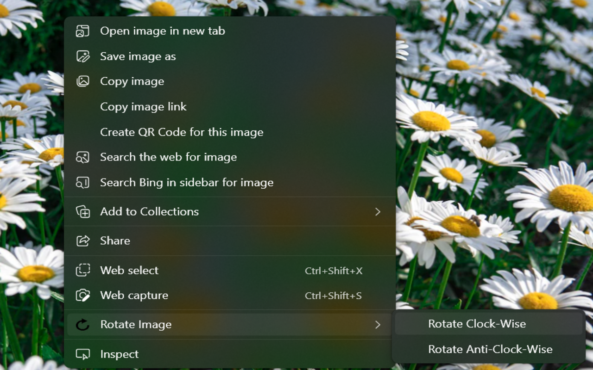

# Rotate Image Extension
Right-click and rotate these neck-killing-wrong-orientation images from Whatsapp Web.

Once the extension is installed, right-click any image from WhatsApp Web and select "Open image in new tab". Then, right-click on the image and hover on "Rotate Image" and then rotate the image clock-wise or anti-clock wise, and the image will rotate 90 degrees. Click again and it will rotate again.
[Chrome Extension](https://chrome.google.com/webstore/detail/messaging-network-image-r/bcgcckcljjhmgfdaoaokoaamjidpjgfh)

