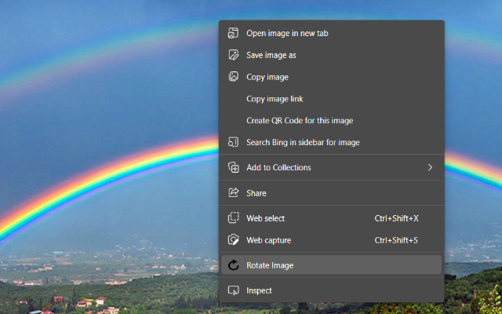

# Rotate Image Extension
Right-click and rotate these neck-killing-wrong-orientation images from Whatsapp Web.

Once the extension is installed, right-click any image from Whatsapp Web and select `Open image in new tab`. Then, right-click on the image and click on "Rotate Image" and the image will rotate 90 degrees. Click again and it will rotate again.

[Chrome Extension](https://chrome.google.com/webstore/detail/whatsapp-web-image-rotato/loplkemdeadljkhhkagbhiindcceajam)

